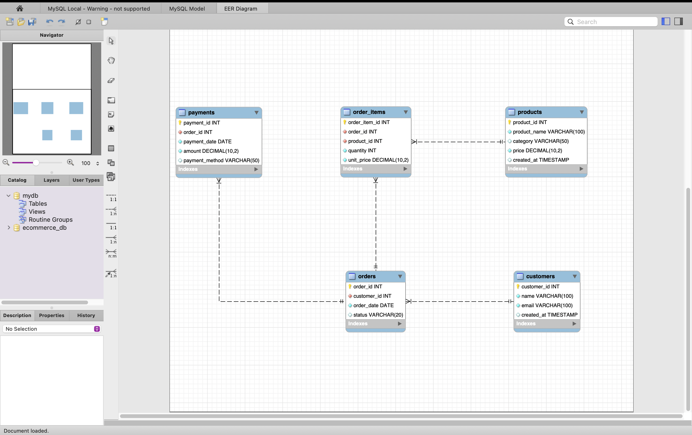
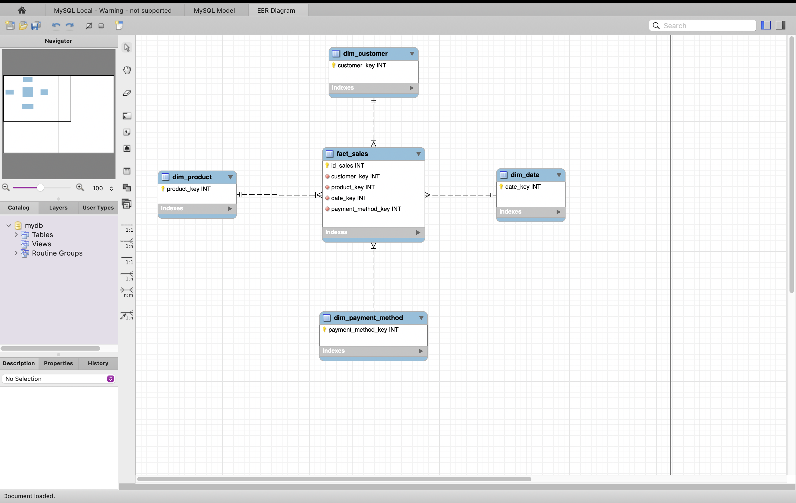

# Database Modeling and Data Warehouse Project

## 📌 Project Overview
This project demonstrates an end-to-end data solution, starting from a transactional database (OLTP) to a fully modeled Data Warehouse using a Star Schema.

The project includes database modeling, ETL automation using Python, and analytical SQL queries to support business decision-making.

---

## 🏗️ Architecture
- OLTP Database (MySQL)
- Data Warehouse (Star Schema)
- ETL Pipeline (Python)
- Analytical Queries (SQL)

---

## 🗂️ Database Modeling (OLTP)
The transactional database was modeled to support an e-commerce scenario, including customers, products, orders, order items, and payments.



---

## 📊 Data Warehouse Model
The Data Warehouse follows a Star Schema design with the following tables:
- fact_sales
- dim_customer
- dim_product
- dim_date
- dim_payment_method



---

## ⚙️ ETL Process
The ETL pipeline was developed in Python and includes:
- Full load strategy (truncate and load)
- Logging for monitoring
- Transaction control (commit / rollback)
- Modular functions for maintainability

To run the ETL:
```bash
python3 etl/etl_dw.py
```
---

## 📈 Analytical Queries

Analytical SQL queries were created using the Data Warehouse (Star Schema) to answer common business questions, such as:

- Revenue evolution per month
- Top-selling products by revenue
- Revenue by payment method
- Average ticket value

These queries demonstrate how fact and dimension tables can be used together to generate meaningful business insights.

📄 SQL file:
sql/analytics_queries.sql

---

## 🛠️ Technologies Used

- MySQL
- MySQL Workbench
- Python
- SQL
- Git & GitHub

---

## 🎯 Key Skills Demonstrated

- Relational Database Modeling (ER Diagram)
- Data Warehouse Design (Star Schema)
- ETL Automation with Python
- Analytical SQL Queries
- Business-Oriented Data Analysis


*Created by Brenda Espinosa*
